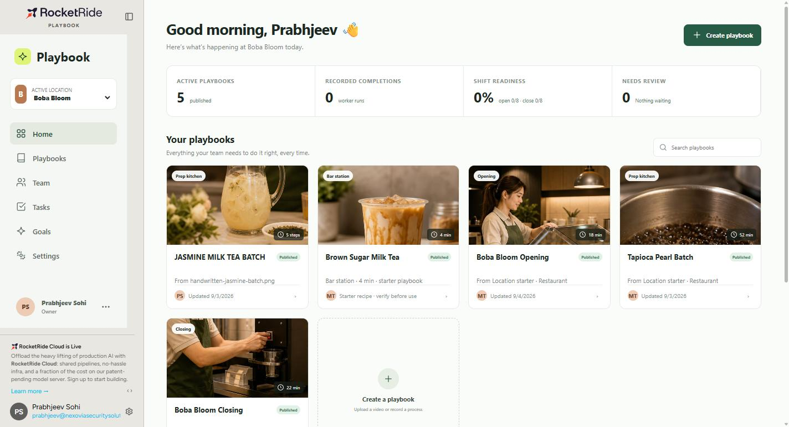
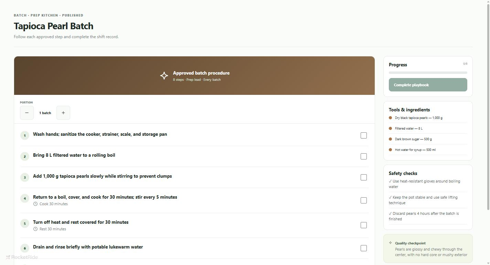

# Playbook

**Turn your best shift into the standard for every shift.**

Playbook takes a recording of an experienced kitchen employee — or a photo of the handwritten recipe card taped inside the cupboard — and turns it into a structured training playbook with measurements, portion scaling, timers, safety checks, and workstation QR access.

Built for the owner or operations manager of a 1–5 location boba shop, where training happens from memory and every shift makes the drink a little differently.

Built on [RocketRide](https://rocketride.ai) for the SCU Buildathon.



---

## Why this exists: the confident wrong answer

Ask a general-purpose AI how long to hold cooked tapioca pearls and it will tell you. It will sound certain. It will not tell you which food code it is drawing on, whether that code applies in your county, or that it is guessing. A shift lead reads it, believes it, and now your shop has a rule nobody can trace.

The danger is not that the model is wrong sometimes. It is that **nothing in the interface distinguishes a verified fact from a fluent guess.**

We hit this inside our own product twice while building it, and both are worth repeating because they are the whole argument.

**The run that failed and looked like it worked.** Our pipeline returned `{"error": {"message": "Invalid API key."}}`. The app did not treat that as a failure — it opened a clean "Review the batch standard" screen with empty fields and a few soft warnings. Anyone glancing at it would have said the feature worked. It produced nothing, confidently, for days before we caught it.

**The verification that never happened.** Our own recipe screen displayed *"Last verified: Aug 29, 2026 — Process owner: Maya Tran."* No one verified anything on August 29. Maya Tran is not a real person. We had written a reassuring label and then believed it ourselves.

Both are fixed. They are in this README because they are exactly what happens to a shop that adopts an AI tool with no review gate — and because a product that claims to fix this problem should be honest about having had it.

## What Playbook does about it

- **Generated content is a draft, never a standard.** Every run lands in an owner review screen. Nothing reaches a worker until a human approves it.
- **Warnings must be acknowledged explicitly.** Missing measurements, absent safety checks, and fields the model was unsure about all block publishing until the owner confirms they checked them against the source.
- **Low model confidence becomes a visible warning.** The pipeline reports per-field confidence; weak fields are named in the review gate rather than hidden.
- **Failures are shown as failures.** A run that errors, or returns no steps and no measurements, says so and offers a retry. It never renders an empty draft as a success.
- **Nothing claims a verification it does not have.** Starter content is labelled starter content. The app does not invent owners, dates, or hold limits.

The value is not that the AI is right. It is that a human signs off before anyone in a kitchen acts on it.

---

## The worker's side

A published playbook opens on a phone at the station. Batch scaling rewrites every measurement, timers attach to the step they belong to, and each step is ticked off as it is done.



The workstation QR is **self-contained** — the playbook is deflated and encoded into the link itself (~620 bytes packed, ~880-character URL). No sign-in, no server round trip, no cross-origin fetch. It works on bad shop wifi.

## What actually runs

Two RocketRide pipelines. Neither is simulated.

| Input | Limits | Pipeline |
| --- | --- | --- |
| Process video | MP4, MOV, WEBM · ≤ 250 MB · 1 s–5 min | `src/process-video.pipe` |
| Photo of written instructions | JPG, PNG, WEBP · ≤ 15 MB | `src/process-instructions.pipe` |

The video pipeline samples up to 24 frames on scene transitions, reads machine-readable text in them, transcribes the audio, extracts a fixed set of structured fields, and passes them to a Groq-hosted model that returns the draft. The instruction pipeline runs the same extraction over a single image.

Both return: title, station, ingredients, ordered steps, timers, safety checks, quality cues, evidence, and per-field confidence.

**The video pipeline reads speech and on-screen text — it does not watch hands.** A silent clip produces nothing, and the app says so rather than inventing steps. Narrate the process out loud when recording.

Measured on staging: median **27 s** end to end, of which 11–15 s is pipeline instantiation.

## Repository layout

```
apps/playbook-ui/
  src/App.tsx                    the application
  src/process-video.pipe         video → structured playbook
  src/process-instructions.pipe  image → structured playbook
  src/pages.css, styles.css      styling
  check.ts                       validate pipelines + cloud storage
  release.ts                     publish a deployed version to a rung
  submit-review.ts               submit for store review
  acceptance-image.ts            end-to-end pipeline acceptance run
  qa-browser.mjs, qa-handoff.mjs browser QA harnesses (CDP)
```

## Running it

Open `apps/playbook-ui/playbook.rrapp` in the RocketRide App Builder.

```bash
corepack pnpm install
corepack pnpm --filter local-playbook build         # typecheck and production build
corepack pnpm --filter local-playbook check:setup   # validate both pipelines and cloud storage
```

Copy `env.example` to `.env` and supply the RocketRide development and deployment connections.

The model provider key is **not** read from `.env` at run time. It is stored in the RocketRide account environment so the server resolves it — a deployed app has no `.env`, which is exactly the bug described above.

## Known limits

- **Single operator.** All state is stored per account, so an owner's playbooks are not visible to a second account. The worker QR carries its own content, which is how a second device sees a real playbook.
- **Starter quantities are ours, not yours.** Every built-in recipe is a starting point that must be checked against the location's approved standard. The app labels them as such.
- Portion scaling covers weights and volumes (g, kg, ml, l, oz, lb, cups, tbsp, tsp) and ranges. It deliberately leaves temperatures, times, and equipment sizes alone.
- English, Spanish, and Chinese step titles exist on the built-in Brown Sugar Milk Tea recipe. Generated playbooks are not yet translated.

## Status

Deployed to RocketRide staging. 128 automated checks across eleven browser suites cover the owner flow, the worker flow, failure handling, mobile layout at two phone widths, content integrity, and the self-contained QR path.

## License

MIT
